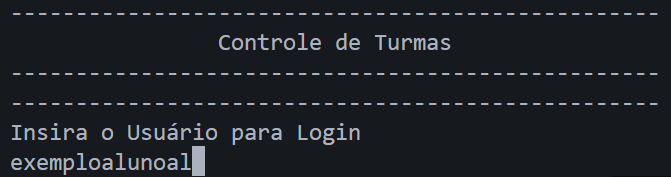
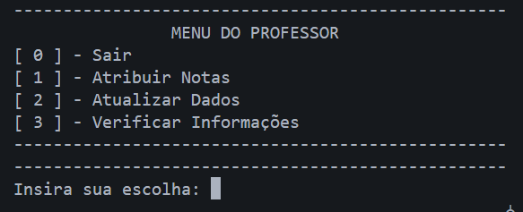
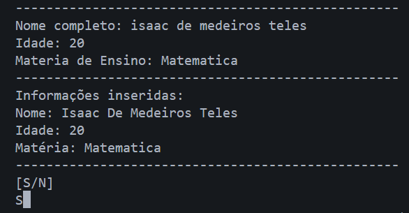

# Sistema de Manipulação de Turmas em Python


## Descrição
Este projeto é um programa em Python para **gerenciar turmas, alunos e professores**, utilizando:  

- **Programação Orientada a Objetos (POO)**
- **Funções customizadas**
- **JSON** para persistência de dados
- **Git** para controle de versão

O objetivo é fornecer uma ferramenta prática e organizada para cadastrar, atualizar e consultar informações de alunos e professores em um ambiente modular e fácil de usar.

---

## Funcionalidades
- Cadastro de **alunos** e **professores** com dados únicos.
- Atualização e remoção de informações.
- Estrutura modular com scripts separados por função e classe.
- Armazenamento de dados em **arquivos JSON**.
- Comentários explicativos no código para facilitar a manutenção.

---

## Exemplos Visuais do Programa

Para facilitar a compreensão, seguem alguns prints do sistema em execução:

### Tela de Login
Mostrando a interface inicial e como o usuário faz login.


### Menu do Professor
Exemplo de como o professor acessa suas funções dentro do sistema.


### Criação de Professor
Mostrando a criação de um novo professor com cadastro automático de usuário.



---

## Estrutura do Projeto

```
manipulacaoTurmas/
├── main.py # Arquivo principal para rodar o programa
├── classes/ # Contém as classes do projeto
│ ├── aluno.py
│ ├── professor.py
│ └── adm.py
├── funcoes/ # Funções auxiliares
│ ├── arquivos.py
│ ├── verificacao.py
│ └── estrutura.py
├── arquivosJson/ # Pasta onde os arquivos JSON são salvos
└── README.md # Este arquivo
```
